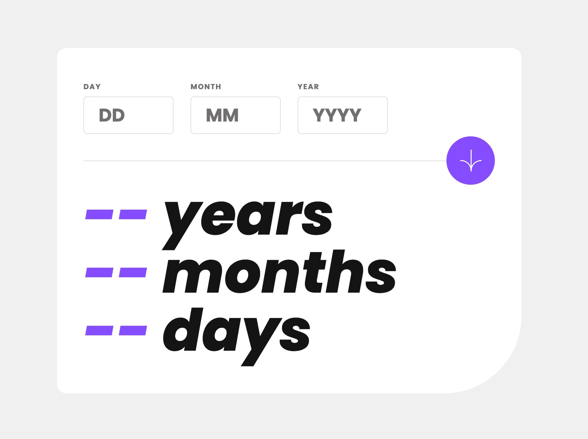

# Frontend Mentor - Age calculator app solution

This is a solution to the Age calculator app challenge on Frontend Mentor](https://www.frontendmentor.io/challenges/age-calculator-app-dF9DFFpj-Q).

## Table of contents

- [Overview](#overview)
  - [The challenge](#the-challenge)
  - [Screenshot](#screenshot)
  - [Links](#links)
  - [Built with](#built-with)

## Overview

### The challenge

Users should be able to:

- View an age in years, months, and days after submitting a valid date through the form
- Receive validation errors if:
  - Any field is empty when the form is submitted
  - The day number is not between 1-31
  - The month number is not between 1-12
  - The year is in the future
  - The date is invalid e.g. 31/04/1991 (there are 30 days in April)
- View the optimal layout for the interface depending on their device's screen size

### Screenshot

### Links

- Solution URL: [https://www.frontendmentor.io/challenges/age-calculator-app-dF9DFFpj-Q/](https://www.frontendmentor.io/challenges/age-calculator-app-dF9DFFpj-Q/)
- Live Site URL: [https://jamesa14.github.io/fm--age-calculator-app/](https://jamesa14.github.io/fm--age-calculator-app/)

### Built with

- HTML5
- Tailwind CSS
- JavaScript
